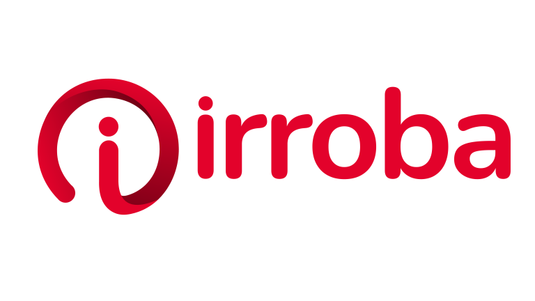
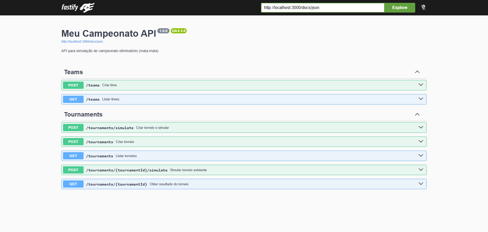

<div align="center">
  
</div>

# API Meu Campeonato

API de simulação de campeonato eliminatório (mata-mata) desenvolvida em Node.js com TypeScript, Fastify e Prisma, seguindo os princípios SOLID e Clean Architecture para garantir um código limpo, testável, escalável e de fácil manutenção.

## ⚽ Principais Funcionalidades da Aplicação

- **Times (Teams):** Cadastro, listagem e gerenciamento de equipes participantes.
- **Torneios (Tournaments):** Criação de campeonatos no formato mata-mata, definindo chaveamentos.
- **Partidas e Simulação:** Geração automatizada dos resultados das partidas (utilizando um script Python integrado) e avanços de chave até a determinação do campeão.

## 🛠️ Tecnologias Utilizadas

Esta arquitetura foi desenhada buscando alta performance e facilidade de integração contínua (CI/CD).

- **Node.js (>= 20):** Ambiente de execução de alta performance.
- **TypeScript:** Tipagem estática para maior segurança em tempo de desenvolvimento.
- **Fastify:** Framework web focado em extrema performance e baixo overhead de recursos.
- **Prisma ORM:** Abstração de banco de dados robusta e type-safe.
- **PostgreSQL:** Banco de dados relacional (via Docker).
- **Zod:** Validação de schemas e dados de entrada (Data Transfer Objects).
- **Vitest:** Framework de testes rápido, com suporte nativo a ESM e TypeScript.
- **Python:** Script auxiliar para processamento algorítmico da geração de scores.
- **Swagger / OpenAPI v3:** Documentação viva e interativa da API.

## 🚀 Como executar o projeto localmente

Siga o passo a passo abaixo para rodar o ambiente de desenvolvimento.

### 📋 1. Pré-requisitos
Certifique-se de ter instalado em sua máquina:
- Node.js (versão 20 ou superior)
- Docker e Docker Compose
- Python 3 (para a geração de placares)

### 📦 2. Clonar e instalar dependências
```bash
# Clone o repositório
$ git clone https://github.com/iamgabrieldev/challenge-irroba.git $ cd challenge-irroba

# Instale as dependências
$ npm install
```
### ▶️ 3. Rodar o projeto localmente
```bash 
# Roda api e banco de dados localmente
$ docker-compose up -d 

# Passo a Passo caso queira rodar de forma manual
$ npm run dev

# Roda as migrations no banco de dados
$ npm run prisma:migrate

# Gera o Prisma Client com as tipagens
$ npm run prisma:generate

# Executar a instancia do banco de dados
$ docker compose up postgres -d
```

### 🧪 4. Executar os testes automatizados
```bash
# Executa a verificação de linter
$ npm run lint

# Executa os testes unitários
$ npm run test

# Executa os testes unitários gerando o relatório de cobertura de código (Coverage)
$ npm run test:coverage

# Obs: O banco de dados (Docker) deve estar rodando, pois este comando 
$ npm run test:e2e
```

## 📚 Documentação da API

### 📖 Swagger / OpenAPI

A API possui documentação interativa via Swagger UI, disponível em:

**URL:** http://localhost:3000/docs

<div align="center">
  
</div>

### 📮 Collection Postman/Insomnia

Para facilitar os testes da API, disponibilizamos uma collection completa com todos os endpoints:

**📥 Download:** [assets/collections-irroba.json](./assets/collections-irroba.json)

**Como usar:**
1. Importe o arquivo `collections-irroba.json` no Postman ou Insomnia
2. Configure a variável `baseUrl` para `http://localhost:3000`
3. Crie 8 times via `POST /teams` e salve os IDs nas variáveis `teamId1` a `teamId8`
4. Use `POST /tournaments/simulate` para criar e simular um campeonato completo

---

## 🔌 Endpoints Disponíveis

### ✅ Health Check
- **GET** `/health` - Verifica o status da API

### 👥 Times (Teams)
- **POST** `/teams` - Criar um novo time
  - Body: `{ "name": "Nome do Time" }`
  - Response: `201` com dados do time criado
  
- **GET** `/teams` - Listar todos os times
  - Response: `200` com array de times

### 🏆 Torneios (Tournaments)
- **POST** `/tournaments` - Criar torneio com 8 times
  - Body: `{ "teamIds": ["uuid1", "uuid2", ..., "uuid8"] }`
  - Response: `201` com dados do torneio criado
  
- **POST** `/tournaments/simulate` - Criar e simular torneio completo
  - Body: `{ "teamIds": ["uuid1", "uuid2", ..., "uuid8"] }`
  - Response: `201` com resultado completo (partidas + pódio)
  
- **POST** `/tournaments/:tournamentId/simulate` - Simular torneio existente
  - Response: `200` com resultado da simulação
  
- **GET** `/tournaments` - Listar todos os torneios
  - Response: `200` com array de torneios
  
- **GET** `/tournaments/:tournamentId` - Obter resultado de um torneio
  - Response: `200` com partidas e pódio (1º, 2º, 3º lugares)

---
